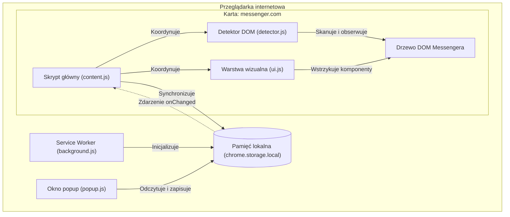
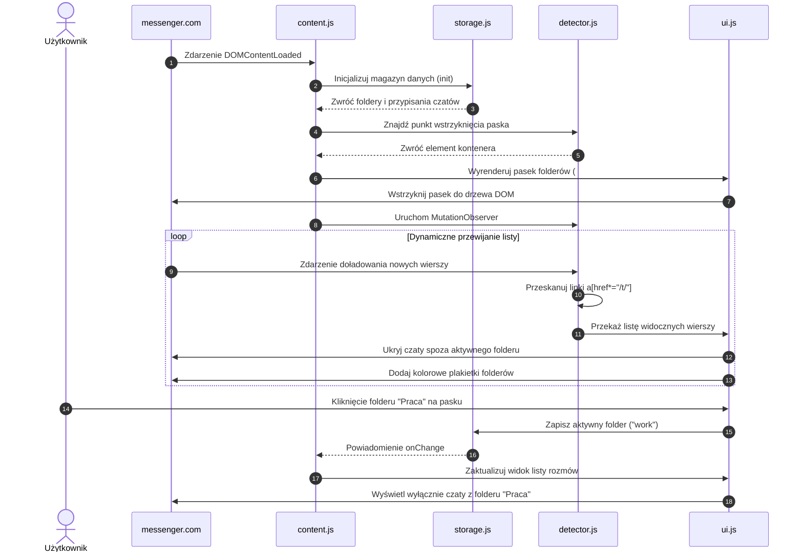

# Architektura techniczna Messenger Folders

> Poznaj architekturę techniczną, przepływ danych oraz mechanizmy odporności wtyczki na zmiany w serwisie Messenger.

Dokument opisuje budowę wewnętrzną rozszerzenia Messenger Folders.
Wyjaśnia sposób integracji z interfejsem Messengera, strukturę danych oraz obsługę dynamicznego kodu HTML.

---

## Spis treści

- [Przegląd architektury](#przegląd-architektury)
- [Struktura modułów](#struktura-modułów)
- [Moduł pamięci (Storage)](#moduł-pamięci-storage)
- [Moduł detektora DOM (Detector)](#moduł-detektora-dom-detector)
- [Odporność na dynamiczne klasy CSS Messengera](#odporność-na-dynamiczne-klasy-css-messengera)
- [Obsługa wirtualnego przewijania (MutationObserver)](#obsługa-wirtualnego-przewijania-mutationobserver)
- [Warstwa interfejsu użytkownika (UI)](#warstwa-interfejsu-użytkownika-ui)
- [Diagram przepływu danych](#diagram-przepływu-danych)
- [Testy jednostkowe](#testy-jednostkowe)

---

## Przegląd architektury

Wtyczka wykorzystuje najnowszy standard rozszerzeń **Manifest V3**.
Działa wyłącznie w środowisku przeglądarki użytkownika.
Nie komunikuje się z żadnymi zewnętrznymi serwerami ani usługami API.

Architektura opiera się na czterech głównych filarach:
1. **Content Scripts**: Skrypty wstrzykiwane bezpośrednio do stron Messengera.
2. **Background Service Worker**: Skrypt tła zarządzający cyklem życia i inicjalizacją danych.
3. **Popup Interface**: Okno podręczne do konfiguracji folderów oraz tworzenia kopii zapasowych.
4. **Chrome Storage Local**: Szybka i bezpieczna pamięć lokalna przeglądarki.



---

## Struktura modułów

Tabela przedstawia pliki wchodzące w skład rozszerzenia:

| Plik | Rola techniczna | Odpowiedzialność |
| :--- | :--- | :--- |
| [manifest.json](../manifest.json) | Plik manifestu | Deklaruje uprawnienia, skrypty oraz punkty wejścia. |
| [background/background.js](../background/background.js) | Service Worker | Inicjalizuje domyślne foldery po instalacji rozszerzenia. |
| [src/storage.js](../src/storage.js) | Warstwa danych | Zarządza strukturą folderów i przypisaniami wątków. |
| [src/detector.js](../src/detector.js) | Silnik detekcji DOM | Odnajduje czaty, linki i punkty wstrzyknięcia interfejsu. |
| [src/ui.js](../src/ui.js) | Generator interfejsu | Tworzy pasek pigułek, plakietki, menu i okna edycji. |
| [src/content.js](../src/content.js) | Koordynator strony | Łączy detektor, pamięć oraz interfejs na karcie Messengera. |
| [src/content.css](../src/content.css) | Arkusz stylów | Nadaje wygląd komponentom i wspiera motyw ciemny. |
| [popup/popup.js](../popup/popup.js) | Logika okna popup | Obsługuje edycję folderów oraz eksport i import JSON. |
| [tests/test_storage_detector.js](../tests/test_storage_detector.js) | Testy jednostkowe | Sprawdza poprawność logiki magazynu danych i detektora. |

---

## Moduł pamięci (Storage)

Klasa [`MessengerFoldersStorage`](../src/storage.js#L30-L580) w pliku [src/storage.js](../src/storage.js) zarządza danymi użytkownika.
Wszystkie operacje wykonuje asynchronicznie za pośrednictwem interfejsu `chrome.storage.local`.

### Model danych

Pamięć przechowuje dane pod trzema stałymi kluczami:

```javascript
// Klucze w chrome.storage.local
const STORAGE_KEYS = {
  FOLDERS: 'mf_folders',          // Lista obiektów folderów
  ACTIVE_FOLDER: 'mf_active_folder', // Identyfikator wybranego folderu
  THREADS: 'mf_threads',          // Mapa przypisań czatów
};
```

1. **Lista folderów (`mf_folders`)**:
   Tablica obiektów definiujących foldery:
   ```json
   [
     { "id": "all", "name": "Wszystkie", "icon": "💬", "color": "#0084FF", "isSystem": true },
     { "id": "work", "name": "Praca", "icon": "💼", "color": "#10B981", "isSystem": false },
     { "id": "uncategorized", "name": "Inne", "icon": "📁", "color": "#6B7280", "isSystem": true }
   ]
   ```
   System blokuje usuwanie folderów systemowych `all` oraz `uncategorized`.

2. **Aktywny folder (`mf_active_folder`)**:
   Pojedynczy identyfikator tekstowy (np. `"work"` lub `"all"`).

3. **Mapa czatów (`mf_threads`)**:
   Słownik łączący unikalny identyfikator wątku z danymi folderu:
   ```json
   {
     "1000123456789": {
       "folderId": "work",
       "name": "Jan Kowalski",
       "avatar": "https://...",
       "assignedAt": 1728500000000,
       "updatedAt": 1728500000000
     }
   }
   ```

### Synchronizacja w czasie rzeczywistym

Moduł nasłuchuje zdarzenia `chrome.storage.onChanged`.
Gdy zmienisz folder w oknie popup, wtyczka natychmiast odświeża interfejs w otwartej karcie Messengera.
Nie musisz przeładowywać strony po dodaniu nowego folderu.

---

## Moduł detektora DOM (Detector)

Klasa [`MessengerDOMDetector`](../src/detector.js#L14-L511) w pliku [src/detector.js](../src/detector.js) odnajduje elementy w drzewie strony.
Przekształca surowe elementy HTML w uporządkowane obiekty wątków.

### Rozpoznawanie identyfikatorów wątków

Metoda `extractThreadIdFromUrl(url)` analizuje adresy URL i wyciąga stabilne ID rozmowy.
Obsługuje wszystkie znane warianty linków na Messengerze i Facebooku:

- Standardowe czaty: `/t/1000123456789`
- Czaty w serwisie Facebook: `/messages/t/1000123456789`
- Czaty szyfrowane E2EE: `/e2ee/t/1000123456789`
- Parametry zapytania: `?selected_item_id=1000123456789`

### Wyszukiwanie punktu wstrzyknięcia paska

Metoda `findFolderBarInjectionPoint()` automatycznie lokalizuje najlepsze miejsce na pasek folderów:
1. Sprawdza obszar bezpośrednio pod polem wyszukiwania kontaktów.
2. Jeśli pole nie istnieje, sprawdza nagłówek listy czatów.
3. W ostateczności umieszcza pasek nad pierwszym widocznym wierszem rozmowy.

Dzięki temu pasek pojawia się zawsze w logicznym miejscu, niezależnie od wersji interfejsu.

---

## Odporność na dynamiczne klasy CSS Messengera

Firma Meta regularnie przebudowuje kod Messengera za pomocą kompilatorów stylów (np. StyleX).
Kompilatory tworzą losowe, zminifikowane klasy CSS (np. `x1n2onr6 x1ja2u2z xh8yej3`).
Klasy te zmieniają się z każdą aktualizacją serwisu.
Tradycyjne wtyczki oparte na selektorach klas szybko przestają działać.

Messenger Folders stosuje strategię pełnej odporności.
Kod nie używa żadnych losowych klas CSS generowanych przez Meta.

### 5 filarów odporności wtyczki

1. **Niezmienne wzorce adresów URL**:
   Wtyczka wyszukuje elementy za pomocą selektora linków:
   ```javascript
   doc.querySelectorAll('a[href*="/t/"]')
   ```
   Struktura odnośników do czatów pozostaje niezmienna od lat.

2. **Semantyczne role ARIA i dostępność (WCAG)**:
   Meta musi wspierać czytniki ekranu dla osób z niepełnosprawnościami.
   Wiersze czatów posiadają trwałe atrybuty semantyczne:
   ```javascript
   linkElement.closest('[role="row"], [role="listitem"], li')
   ```
   Standardy dostępności gwarantują stabilność tych selektorów.

3. **Uniwersalne atrybuty układu tekstu**:
   Nazwy kontaktów znajdują się zawsze w kontenerach z atrybutem kierunku tekstu:
   ```javascript
   rowElement.querySelectorAll('span[dir="auto"]')
   ```
   Atrybut `dir="auto"` zapewnia poprawną obsługę wielu języków.

4. **Trwałe atrybuty własne (`data-mf-*`)**:
   Po wykryciu wiersza czatu detektor nadaje mu własny atrybut:
   ```javascript
   rowElement.setAttribute('data-mf-thread-id', threadId);
   ```
   Kolejne operacje filtrowania odwołują się już bezpośrednio do atrybutu wtyczki.

5. **Własna przestrzeń nazw CSS**:
   Wszystkie komponenty interfejsu wtyczki mają przedrostek `mf-` (np. `#mf-folder-bar`, `.mf-folder-pill`).
   Żaden styl wtyczki nie koliduje z oryginalnym kodem Messengera.

---

## Obsługa wirtualnego przewijania (MutationObserver)

Messenger stosuje technikę wirtualnego przewijania (ang. *virtual scrolling*).
W drzewie DOM znajdują się tylko te czaty, które aktualnie mieszczą się na ekranie.
Podczas przewijania przeglądarka usuwa niewidoczne elementy i wstawia nowe wiersze.

Aby zapewnić płynne działanie, detektor tworzy obiekt `MutationObserver`:
- Obserwuje dodawanie i usuwanie węzłów w elemencie `document.body`.
- Wykorzystuje technikę dławienia wywołań (**throttling**) z interwałem 250 ms.
- Chroni procesor przed nadmiernym obciążeniem podczas szybkiego przewijania listy.
- Błyskawicznie oznacza nowo doładowane wiersze czatów i stosuje aktywny filtr przy użyciu pamięci podręcznej (bez odpytywania pamięci `chrome.storage.local`).
- Pasek folderów jest wstrzykiwany tylko w razie potrzeby (przy starcie lub gdy kontener zostanie usunięty przez SPA).

---

## Warstwa interfejsu użytkownika (UI)

Klasa [`MessengerUI`](../src/ui.js) w pliku [src/ui.js](../src/ui.js) tworzy wszystkie elementy graficzne:

- **Moduł paska folderów (`#mf-folder-bar`)**:
  Dwurzędowy kontener umieszczony nad listą czatów:
  - **Górny wiersz (`.mf-folder-top-bar`)**: zawiera pole wyszukiwarki folderów w czasie rzeczywistym oraz przypięty obok przycisk ustawień `⚙️`.
  - **Dolny wiersz (`.mf-folder-pills-row`)**: poziomy pasek pigułek z płynnym przewijaniem za pomocą kółka myszy, gestu dotykowego lub bocznych strzałek.
- **Wskaźnik w nagłówku (`.mf-header-pill`)**:
  Pigułka umieszczona u góry aktywnej konwersacji. Ułatwia szybką zmianę kategorii.
- **Menu wyboru folderu (`.mf-dropdown-menu`)**:
  Wyskakujące menu z wbudowaną wyszukiwarką.
  Inteligentnie dopasowuje swoją pozycję, aby nie wychodzić poza krawędź ekranu.
- **Okno edycji i zarządzania folderami (`.mf-modal`, `.mf-settings-modal`)**:
  Centrum zarządzania folderami, przypisywania czatów, wyboru emoji i kolorów oraz kopii zapasowej.

### Zgodność z motywem jasnym i ciemnym

Plik [src/content.css](../src/content.css) pobiera wartości kolorów bezpośrednio ze zmiennych środowiskowych Meta:
- `--surface-background`
- `--primary-text`
- `--secondary-text`
- `--hover-overlay`

Dodatkowo styl nasłuchuje reguły `@media (prefers-color-scheme: dark)` oraz klasy `.__fb-dark-mode`.
Interfejs wtyczki wygląda naturalnie i spójnie w każdym motywie Messengera.

---

## Diagram przepływu danych

Poniższy diagram sekwencyjny ilustruje cykl życia wtyczki od załadowania strony po filtrowanie czatów:



---

## Testy jednostkowe

Projekt zawiera zautomatyzowany zestaw testów w pliku [tests/test_storage_detector.js](../tests/test_storage_detector.js).
Testy nie wymagają zewnętrznych bibliotek i uruchamiają się bezpośrednio w środowisku Node.js.

### Zakres testów

1. **Walidacja pliku manifestu**:
   Sprawdza poprawność pól `manifest_version`, `permissions`, `host_permissions` oraz ścieżek do plików.
2. **Magazyn danych (`MessengerFoldersStorage`)**:
   - Inicjalizacja folderów startowych.
   - Tworzenie, edycja i usuwanie folderów użytkownika.
   - Blokada usuwania folderów systemowych.
   - Bezpieczne przenoszenie czatów z usuwanego folderu do kategorii `uncategorized`.
   - Przypisywanie i odpinanie wątków.
   - Eksport i import danych w formacie JSON.
   - Obsługa funkcji zwrotnych `onChange`.
3. **Detektor DOM (`MessengerDOMDetector`)**:
   - Rozpoznawanie wszystkich wariantów adresów URL wątków.
   - Odróżnianie znaczników czasu i liczników od nazwisk kontaktów.

### Uruchomienie testów

Aby uruchomić testy jednostkowe, wykonaj polecenie w katalogu projektu:

```bash
node tests/test_storage_detector.js
```

Wynik testów potwierdza pełną sprawność logiki biznesowej rozszerzenia.
